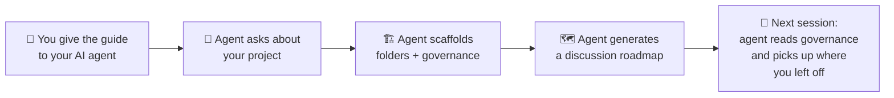
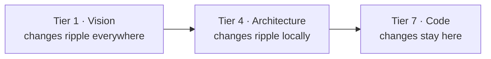
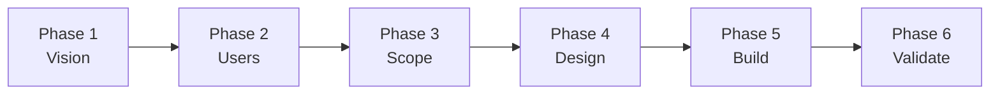

<div align="center">

# AI Product Bootstrap

**A structured way to build products with AI agents. From idea to product, built to last.**

Give this guide to your AI agent. The agent sets up organized folders and a plan for what to figure out first.

[](LICENSE)
[](https://github.com/ThanhWilliamLe/ai-product-bootstrap/pulls)

</div>

---

For developers and founders who use AI agents to build products and are tired of re-explaining context each session.

Works with Claude, ChatGPT, Gemini, Copilot, Cursor. Anything that reads markdown.

## How it works



1. Drop [`bootstrapping-guide.md`](bootstrapping-guide.md) into a conversation
2. Describe what you're building
3. Answer a few questions
4. The agent builds the project scaffold:

```
0A-ceo/                  # Dashboard, priorities, roadmap
1A-vision/               # Problem, goals, personas
2A-research/             # Ecosystem, competitors
3A-requirements/         # Scope, MVP definition
4A-design/               # Interaction model, wireframes
4B-architecture/         # System design, tech stack
5A-specs/                # Feature specifications
5B-quality/              # Test strategy, edge cases
6A-build-plan/           # Implementation plan
7A-app/                  # Source code
AA-journal/              # Session logs
AB-decisions/            # Decision records
```

Each folder has a governance file that says what belongs and where to redirect mistakes. Next session, the agent reads these first and picks up your context.

The number of folders scales to your project. A weekend library might get 7, a team SaaS product 16.

## What's behind it

Three ideas drive the guide:

**Hats.** The agent declares a role before doing anything. Product Owner thinks about *what* to build, Developer thinks about *how*. You get focused answers instead of a mix of strategy and implementation.

**Tiers.** Folders are numbered by how much their decisions ripple outward. You work top-down. AI agents won't do that on their own.



**Discussion roadmap.** Folders start as empty stubs. You fill them across sessions, each phase with a goal and deliverables.



**Autonomous continuation.** The dashboard has a machine-readable "Next Action" table. Agents pick up work without you prompting. After build, a validation loop spawns sub-agents as different users to test scenarios until 97% pass rate.

> [!TIP]
> You don't need to understand any of this before starting. The agent walks you through it.

## Examples

See walkthroughs for different project sizes:

| Project type | Roles | Folders |
|-------------|-------|---------|
| Open source library | 4 | 7 |
| CLI tool | 5 | 10 |
| SaaS platform | 10 | 16 |
| Analytics product | 6 | 10 |

Plus templates for governance files: dashboards, role profiles, decision records, session logs.

## Get started

```bash
# Clone and use
git clone https://github.com/ThanhWilliamLe/ai-product-bootstrap.git

# Or grab the guide directly
curl -O https://raw.githubusercontent.com/ThanhWilliamLe/ai-product-bootstrap/main/bootstrapping-guide.md
```

Then open it in a conversation with your AI agent and say what you're building.

## Contributing

If you run into a project type that doesn't fit, open an issue or PR against `bootstrapping-guide.md`.

This repo contains the guide and this README. Nothing else.

## Support

[](https://ko-fi.com/ThanhWilliamLe)

## Star History

[](https://star-history.com/#ThanhWilliamLe/ai-product-bootstrap&Date)

## License

[MIT](LICENSE)
