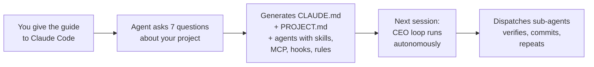
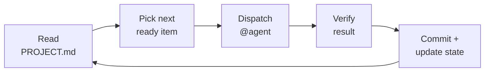

<div align="center">

# AI Product Bootstrap

**A structured way to build products with AI agents. Two files. CEO loop. Sub-agent dispatch.**

Give this guide to Claude Code. It sets up an autonomous orchestration system: a CEO agent that reads state, dispatches specialized sub-agents, verifies results, and keeps going.

[](LICENSE)
[](https://github.com/ThanhWilliamLe/ai-product-bootstrap/pulls)

</div>

---

## How it works



1. Drop [`bootstrapping-guide.md`](bootstrapping-guide.md) into a Claude Code conversation
2. Describe what you're building
3. Answer a few questions
4. The agent produces your project's operating system:

```
CLAUDE.md                  # CEO operating manual — the loop, dispatch rules, conventions
PROJECT.md                 # Live state — goals, work queue, decisions
.claude/
├── agents/                # Sub-agents with skills, MCP servers, hooks, permissions
├── rules/                 # Path-specific context (shared across agents)
└── settings.json          # Project-level defaults
docs/                      # Knowledge base — decisions, specs, research (as needed)
```

Next session, Claude reads CLAUDE.md automatically, becomes the CEO, reads PROJECT.md, and starts working.

## What's behind it

**CEO orchestration.** The main Claude Code agent is always the CEO. It reads state, decides what's next, dispatches sub-agents to do the work, verifies results, and loops. It doesn't implement — it orchestrates.

**Sub-agent dispatch.** Each agent type (developer, researcher, designer, qa) has its own definition in `.claude/agents/` with scoped tools, file ownership, conventions, verification commands, preloaded skills, MCP server access, safety hooks, and permission modes. Agents get fresh context windows — no context rot.

**Bounded state.** PROJECT.md is a sliding window, not a ledger. Done items clear on version ship. Git tags are the archive. The file never grows past ~150 lines.

**Same loop, always.** There's no mode switch between "planning" and "building" and "post-launch." Discovery is just work items with type `discover`. Building is items with type `build`. Version 0.1 through 5.0 — same loop.



## Agent infrastructure

Each agent definition is a fully-configured Claude Code agent — not just a prompt. The installer generates:

| Feature | What it does | Example |
|---------|-------------|---------|
| **Skills** | Preloads domain knowledge into agent context | `skills: [python-testing-patterns, frontend-patterns]` |
| **MCP servers** | Scoped external tools (database, browser, APIs) | Playwright for QA, PostgreSQL for data agents |
| **Hooks** | Enforces scope constraints at runtime | Designer blocked from writing `.py`/`.ts` files |
| **Rules** | Path-specific context shared across agents | `src/**` conventions load for any agent touching source |
| **Permissions** | Controls autonomy level per agent | `acceptEdits` for builders, `default` for read-only |
| **Effort/Turns** | Cost control and runaway prevention | `maxTurns: 30`, `effort: medium` |

All inferred from 7 discovery questions. Degrades gracefully — if no skills are installed or no MCP needed, agents work fine with built-in tools.

## Token efficiency

Three-tier context model inspired by [Codified Context](https://arxiv.org/abs/2602.20478):

| Tier | What | When loaded | Size |
|------|------|-------------|------|
| 1 | CLAUDE.md + PROJECT.md | Every session (auto) | ~300-500 lines |
| 2 | Agent definitions | On dispatch only | ~50-100 lines each |
| 3 | docs/ + src/ | On demand by agents | Variable |

CEO pays for Tier 1 only. Sub-agents get focused context. Main conversation stays light.

## Get started

```bash
# Grab the guide
curl -O https://raw.githubusercontent.com/ThanhWilliamLe/ai-product-bootstrap/main/bootstrapping-guide.md
```

Drop it into Claude Code and say what you're building. That's it.

## What changed from v1

v1 was a 1200-line guide with 16 governance folders, hat declarations, tier assignments, and a session protocol that loaded 4 files before any work started. It worked well for initial builds (0 to 1.0) but broke down for ongoing development, cost too many tokens, and wasn't truly autonomous.

v2 is 300 lines. Two files. One loop. Works from day one through version N.

| v1 | v2 |
|---|---|
| 16 folders with CLAUDE.md each | Flat: CLAUDE.md + PROJECT.md + agents/ + docs/ |
| Load 4 governance files per session | Auto-load 2 files, agents load on dispatch |
| Declare a "hat" before working | CEO dispatches the right agent automatically |
| Discussion roadmap with phases | Work queue with dependencies |
| Post-MVP needs different workflow | Same loop, same files, always |
| 56:1 doc-to-code ratio | Docs grow organically, stay lean |

## Built with this guide

| Project | What it is | Status |
|---------|-----------|--------|
| [ai-plugin-manager](https://github.com/ThanhWilliamLe/ai-plugin-manager) | Desktop app to manage AI tool plugins | v1.5 shipped |
| [devlead-station](https://github.com/ThanhWilliamLe/devlead-station) | Local-first code review tool for dev leads | v1.2 shipped |
| [ai-animator](https://github.com/ThanhWilliamLe/ai-animator) | AI-powered animation generator for Unity | MVP complete |

## Contributing

If you run into a project type that doesn't fit, open an issue or PR against `bootstrapping-guide.md`. See our [issue templates](.github/ISSUE_TEMPLATE/) for guided reporting.

## Support

[](https://ko-fi.com/ThanhWilliamLe)

## Star History

[](https://star-history.com/#ThanhWilliamLe/ai-product-bootstrap&Date)

## License

[MIT](LICENSE)
